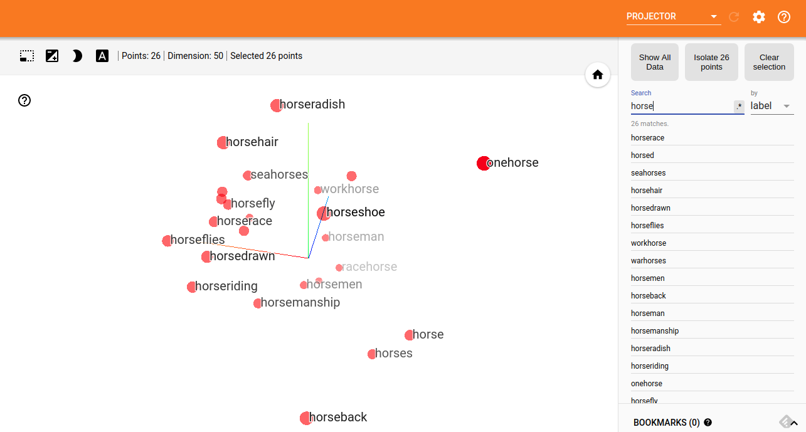

Semantic Sentence Representation
=======
Representing sentences using word vectors semantically and visualizing them in 3 dimensional space

## Usage

```
python : 3.5

```

Sample Word representations from Tensorboard


